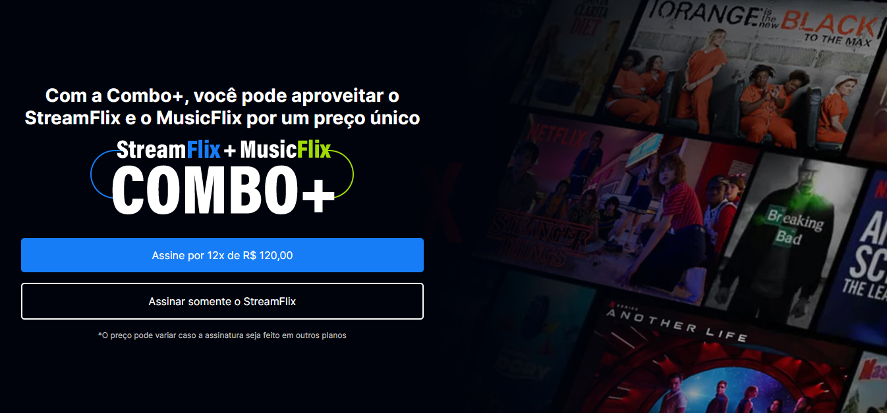
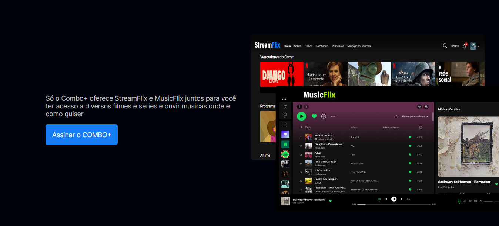
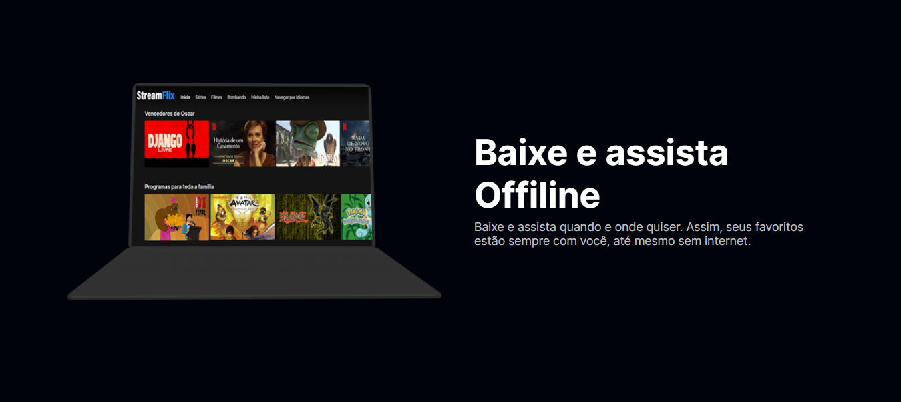
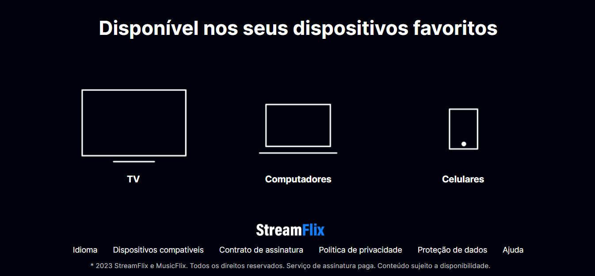

# StreamFlix - Filmes e Series

Nesse projeto eu desenvolvi uma página de um serviço de streaming, o StreamFlix. Com a proposta de criar um projeto prático utilizando o <b>HTML e CSS</b>

<h6 align="center"><a href="https://jean-carlo-torres.github.io/streamflix/">**Link para testar o projeto**</a></h6>

 

<h3>Contribuindo</h3>

⭐️ Star o projeto

🐛 Encontrar e relatar issues